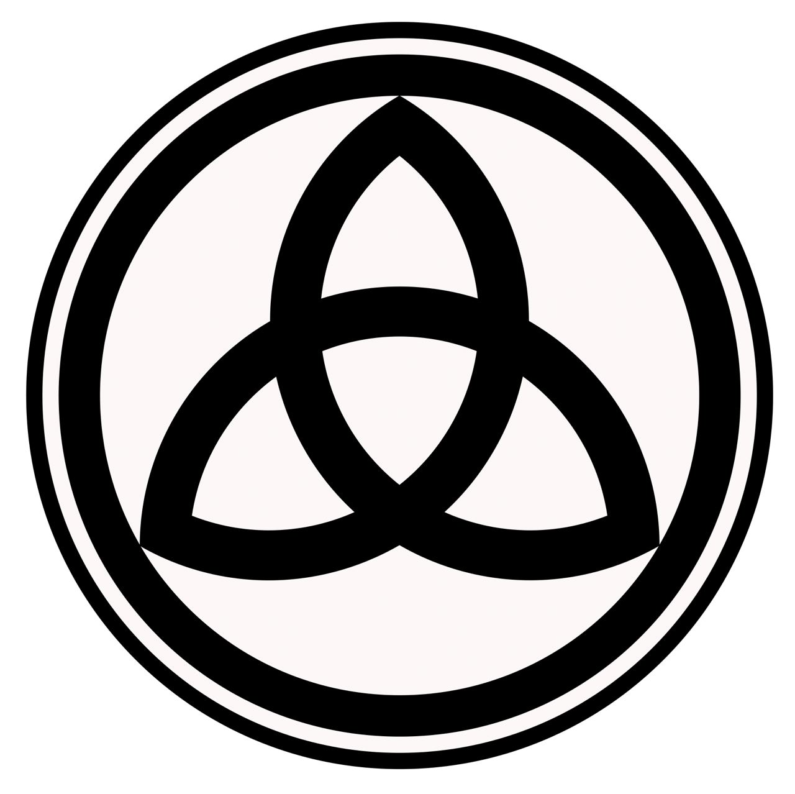

---
{}
---

Знак ОСНОВАНИЯ - это сакральное ТРИЕДИНСТВО, которое состоит из трех оболочек: Дух, Разум, Тело.
Физический рост, интеллектуально развитие и духовное усиление.

## Дух-Тело-Сознание

**Главную роль в поведении человека играет ДУХ**, моя суть, моя воля, мои убеждения.
Вторая роль - тело, эмоции.
И только потом сознание, которое обслуживает первых двух, но свято верит, что вся полнота власти принадлежит ему, ибо обман - это лучше, чем шизофрения и когнитивный диссонанс.

Многие тренируют тело. Некоторые тренируют интеллект. Но никто не работает с самым главным, с духом. Потому что это агент глубокого внедрения, который не любит рекламы и шума.

> Дух настолько эффективен в принятии решений, что большинство смертных даже не догадываются о его существовании. Однако самые главные решения в вашей жизни принимает он. Чем сильнее дух, тем выше потенциал личности.

**ДУХ** приобретает силу через испытания, с помощью разума и тела
**РАЗУМ** развивают благородные основы, Договор Консенсуса
**ТЕЛО** развивают ритуальные заветы

## Жизнь - это тренировка

Боль стимулирует мою эволюцию. Это **последовательный процесс, от тела, через разум, к духу.** Ребенку служит тело, взрослому разум, а мудрому дух.

> У большинства смертных дух спит, а их разум слаб. Потому что они не знают Замысел. Всю жизнь они живут зовом тела и поэтому страдают. Нет развития, нет реализации, нет смысла

[Философия Основания](Философия%20Основания.md)
